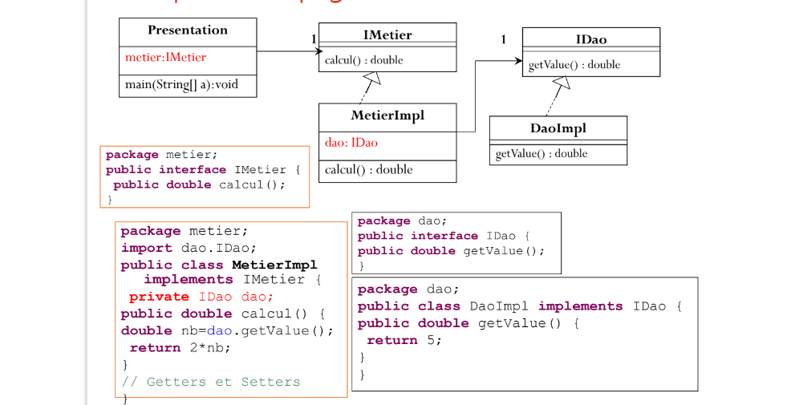
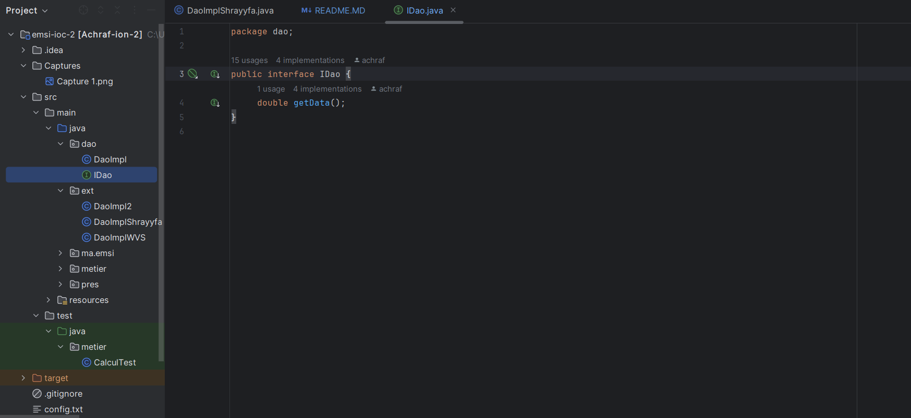
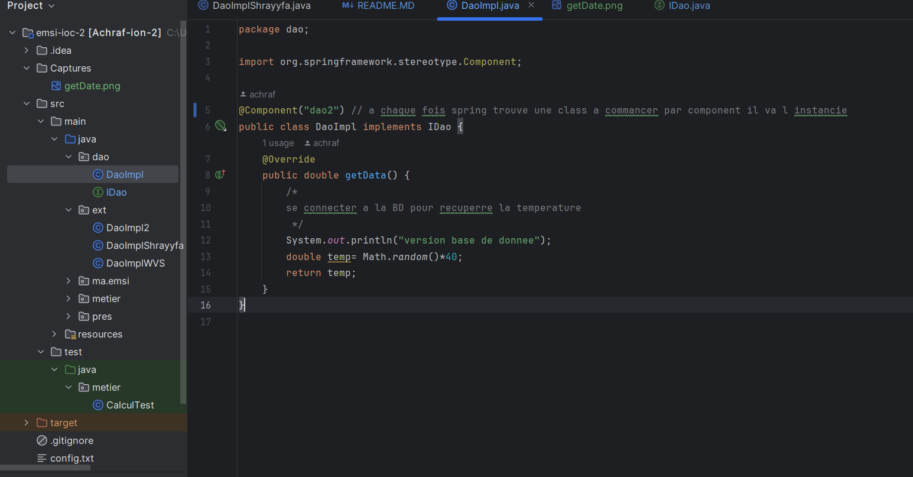
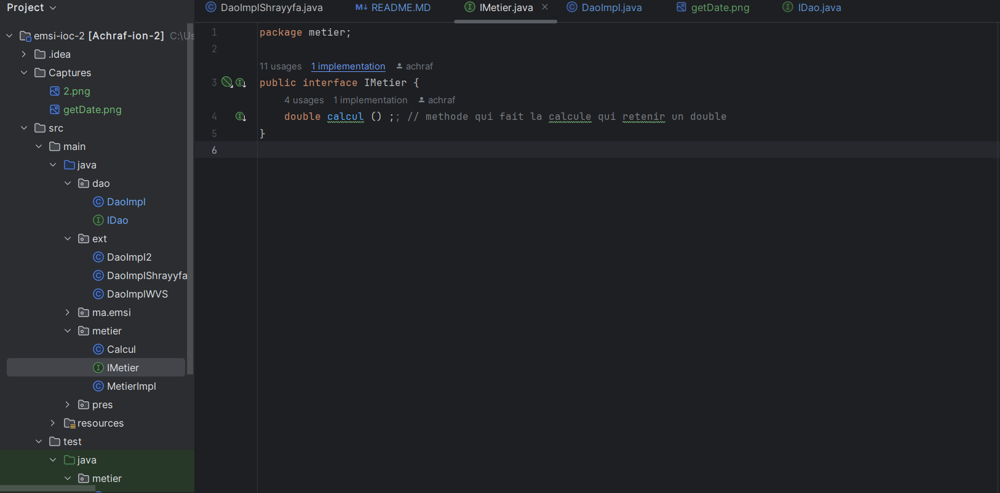
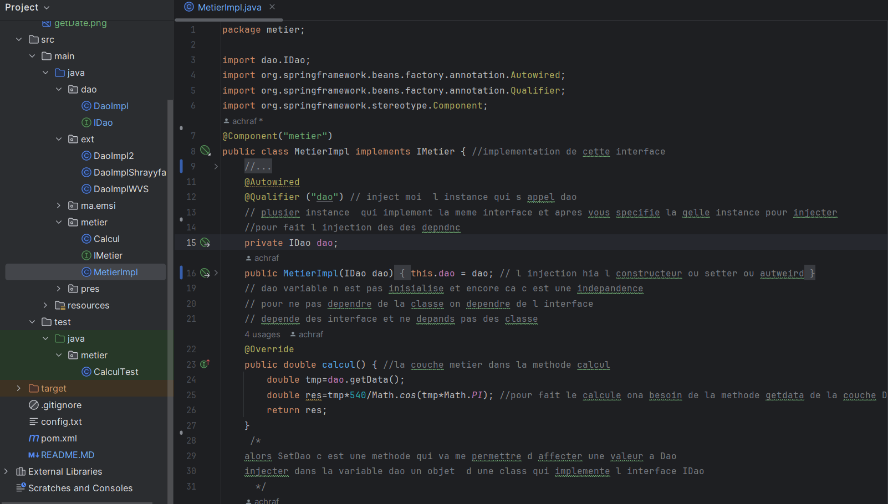
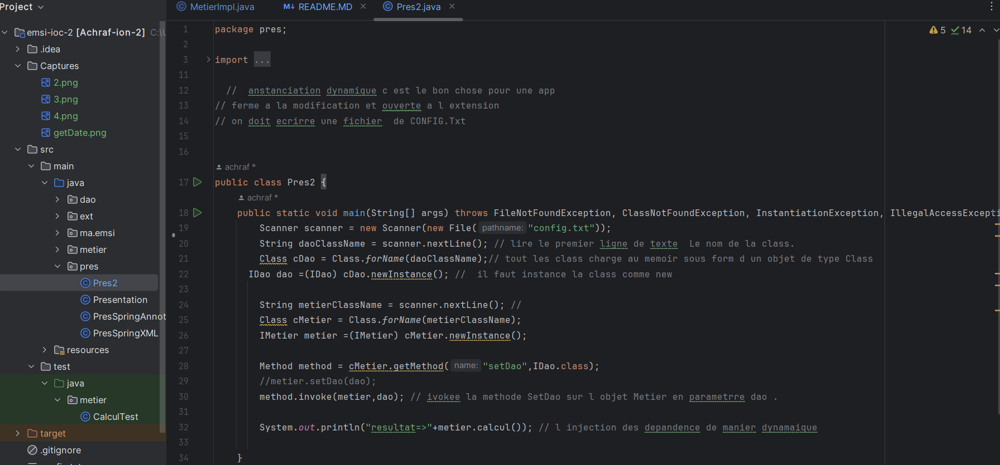

<h3> Principe de l’Inversion de Contrôle et Injection des dépendances </h3>
<h3> L’Inversion de contrôle :</h3>

 • Permettre au développeur de s’occuper uniquement du code métier (Exigences fonctionnelles) et c’est le Framework qui s’occupe du code technique (Exigences Techniques)

L’Injection des dépendances :
• Une application doit évoluer dans le temps
• L’application doit être fermée à la modification et ouverte à l’extension
• Avec le couplage faible, nous pourrons créer des application fermée à la modification et ouvertes à l’extension.

Le Couplage faible :
• Pour utiliser le couplage faible, nous devons utiliser les interfaces. • Considérons une classe A qui implémente une interface IA, et une classe B qui implémente une interface IB.
• Si la classe A est liée à l’interface IB par une association, on dit que le classe A et la classe B sont liées par un couplage faible.
• Cela signifie que la classe B peut fonctionner avec n’importe quelle classe qui implémente l’interface IA.
• En effet la classe B ne connait que l’interface IA. De ce fait n’importe quelle classe implémentant cette interface peut être associée à la classe B, sans qu’il soit nécéssaire de modifier quoi que se soit dans la classe B.

<h3> Exemple de couplage faible :</h3>

<h3>L'interface daoInterface avec une méthode getDate</h3>

<h3>Une implémentation de cette interface (daoImplementation)</h3>

<h3>l'interface metierInterface avec une méthode calcul</h3>

<h3>Une implémentation de cette interface en utilisant le couplage faible (metierImplementation)</h3>

<h3>L’Injection des dépendances par : </h3>
<h4> 1) Instanciation Dynmaquie :  </h4>
<h5> config.txt est un fichier contenant les noms des classes souhaitant instancier.</h5>

